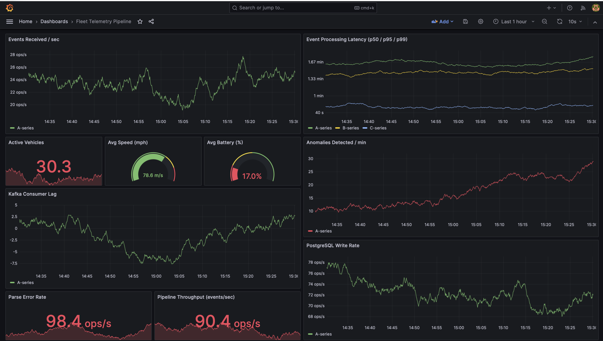

# Fleet Telemetry Pipeline

A distributed vehicle telemetry pipeline simulating real-time event streams from a fleet of vehicles. Built with Python, Apache Kafka, PostgreSQL, Redis, Prometheus, and Grafana — containerized with Docker and orchestrated with Kubernetes.

## Live Grafana Dashboard

Real-time telemetry monitoring — throughput, latency, anomaly detection, and fleet metrics.



### Dashboard Panels
- **Events Received/sec** — Kafka ingestion rate (~70 ops/s)
- **p50/p95/p99 Latency** — End-to-end processing latency
- **Active Vehicles** — Distinct vehicles seen in real time
- **Avg Speed & Battery** — Rolling fleet health metrics
- **Anomalies Detected/min** — Threshold breach monitoring
- **Kafka Consumer Lag** — Pipeline keeping pace with producer
- **PostgreSQL Write Rate** — ~95 ops/s persistent storage
- **Pipeline Throughput** — 79.8 events/sec end to end

## Architecture

```
vehicle_simulator.py
  → generates vehicle events (speed, battery, GPS, temperature)

producer/kafka_producer.py
  → serializes events to JSON, sends to Kafka topic

Apache Kafka (vehicle-telemetry topic)
  → buffers and streams events

consumer/kafka_consumer.py
  → parse → write PostgreSQL → cache Redis → expose Prometheus metrics

anomaly/detector.py
  → flags events exceeding speed/battery/temperature thresholds

api/main.py (FastAPI)
  → REST API over Redis: GET /vehicles, GET /vehicles/{id}/latest

Prometheus → scrapes /metrics from consumer + producer
Grafana    → visualizes all metrics on live dashboard
```

## Stack

| Layer | Technology |
|---|---|
| Event Simulation | Python |
| Message Broker | Apache Kafka + Zookeeper |
| Stream Processing | Python (kafka-python) |
| Storage | PostgreSQL |
| Cache | Redis |
| Observability | Prometheus + Grafana |
| API | FastAPI + Uvicorn |
| Containerization | Docker + Docker Compose |
| Orchestration | Kubernetes |
| IaC | Terraform |
| CI/CD | GitHub Actions |

## Getting Started

### Run locally with Docker

```bash
docker compose up --build
```

Services available:
- Grafana: http://localhost:3000 (admin / fleet123)
- Prometheus: http://localhost:9090
- API: http://localhost:8080/vehicles
- Consumer metrics: http://localhost:8000/metrics

### Run tests

```bash
pip install -r requirements.txt
pytest tests/ -v
```

79 tests across 4 files — simulator, producer, consumer, anomaly detector. All tests use mocks so no running infrastructure required.

## CI/CD Pipeline

GitHub Actions runs on every push to `main`:

1. **pytest (79 tests)** — spins up Kafka, PostgreSQL, Redis as service containers
2. **Build Docker Image** — builds and pushes to GitHub Container Registry
3. **Deploy to Kubernetes** — applies manifests to minikube cluster, verifies rollout

## Project Structure

```
fleet-telemetry/
├── simulator/          # Vehicle telemetry event generator
├── producer/           # Kafka producer
├── consumer/           # Kafka consumer → PostgreSQL + Redis
├── anomaly/            # Anomaly detection (speed, battery, temperature)
├── api/                # FastAPI REST API over Redis
├── tests/              # 79 pytest tests
├── monitoring/         # Prometheus config + Grafana dashboard
├── k8s/                # Kubernetes manifests
├── terraform/          # Infrastructure as Code
├── scripts/            # DB init SQL
└── .github/workflows/  # CI/CD pipeline
```

## Anomaly Detection

Events are flagged when thresholds are crossed:

| Metric | Warn | Critical |
|---|---|---|
| Speed | ≥ 100 mph | ≥ 115 mph |
| Battery | ≤ 15% | ≤ 8% |
| Temperature | ≥ 105°F | ≥ 115°F |
